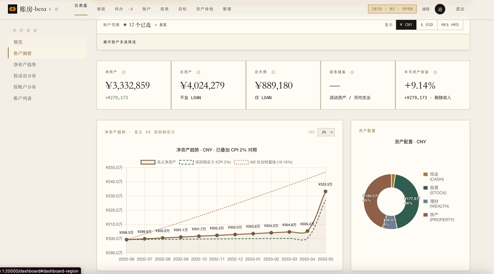
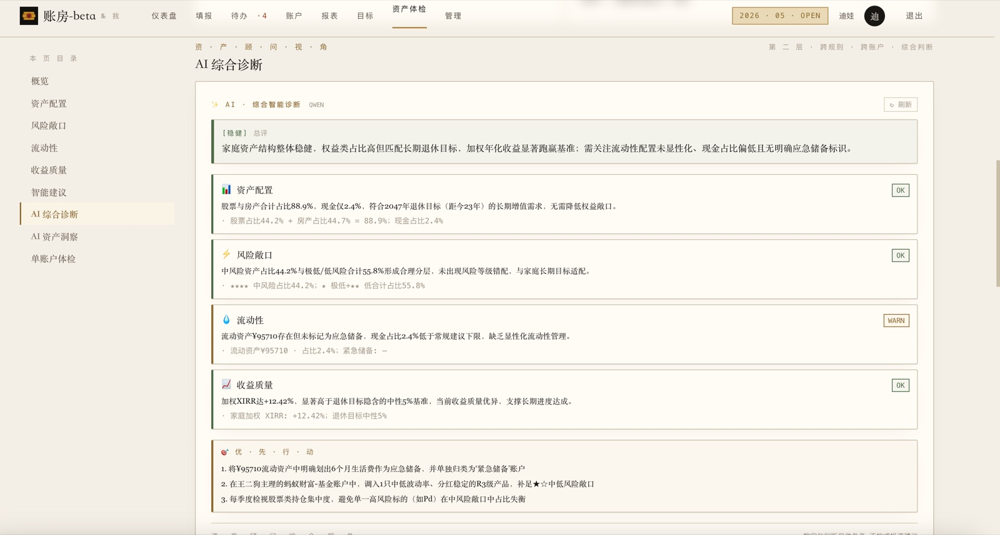
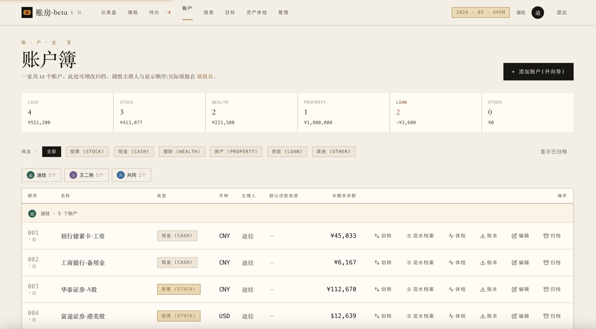
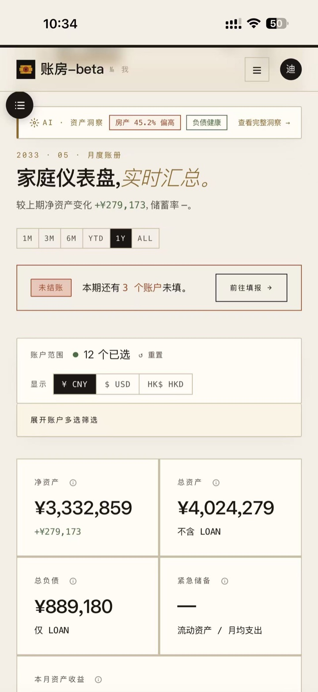
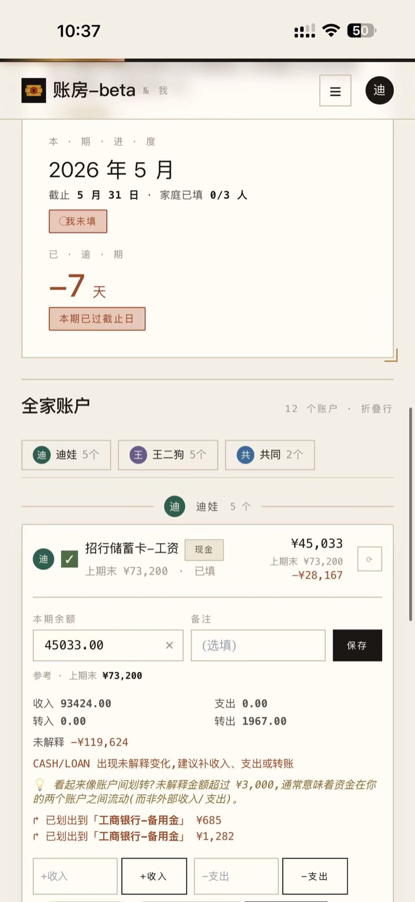
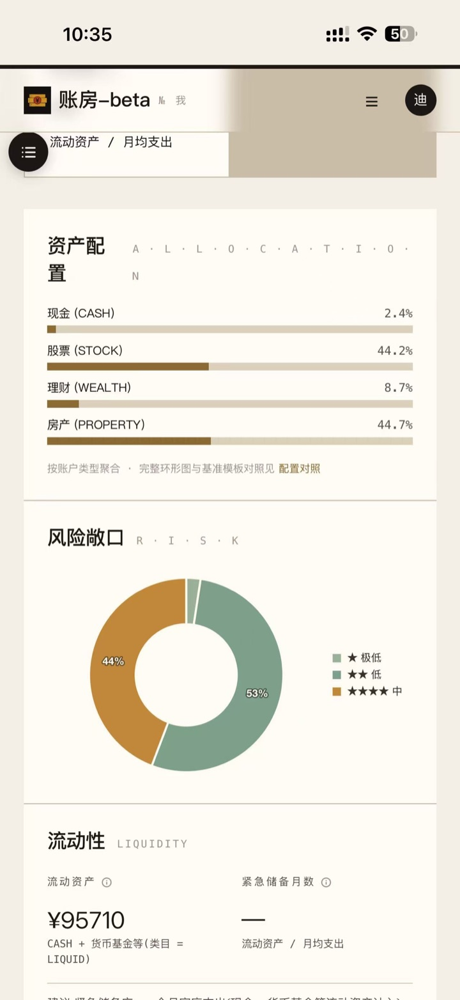
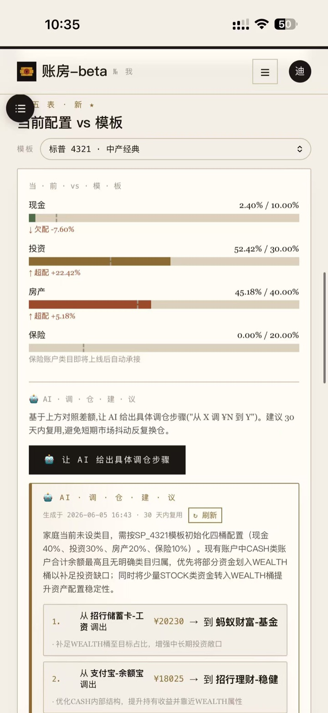

# 家庭账房 · Family Ledger

> **每月 10 分钟,把全家散在各处的钱,变成一张只在你自己服务器上的资产全局图**——
> 算得出真实年化、分得清「人赚的」和「钱赚的」,还有 AI 帮你诊断持仓与配置、看清风险敞口、
> 把再平衡和下一步落成可执行的行动(只解读,不荐产品、不预测涨跌)。

[](LICENSE)
[](https://openjdk.org/projects/jdk/21/)
[](https://spring.io/projects/spring-boot)

<p align="center">
  
  <br>
  <sub><b>仪表盘</b> · 全家净资产 / 趋势(叠加 CPI 购买力线 + M2 社会财富线)/ 资产配置 — 一屏总览</sub>
</p>

---

## 在线体验 · Live Demo(无需部署)

不想先架服务器?直接进演示环境随便点 —— 合成数据、完整功能、手机电脑都行:

### → https://beta.dixi-token.top

| 用户名 | 密码 |
|---|---|
| `wangergou` | `demo1234` |

> 演示环境(beta · HTTPS)· **大家共用 · 全是合成的假数据**:随便逛、随便改都行,但**请勿录入任何真实隐私信息**。
> 想长期、私密地用?往下看「快速开始」自托管一份 —— 数据只待在你自己的服务器上。

## 这是给谁的

**✓ 适合** —— 能自己架一台 Linux 服务器 · 钱散在银行 / 支付宝 / 券商 / 房产 / 房贷 · 在意隐私,不想把全家财务交给任何商业 App · 想知道**真实**年化收益(不是 App 给你看的那种)。

**✗ 不适合** —— 想下个应用商店 App 就用(本项目要自部署)· 想逐笔每日记账(这是**月度快照**,不是流水账)· 想要预算省钱那类记账。

## 它解决什么(你大概也在问这几个问题)

家庭资产散在 N 个渠道(银行 / 支付宝 / 券商 / 房产 / 房贷……),日常没系统记录:

- **「我们家现在到底有多少钱?」** —— 散成 N 处,没人看得到全局。
- **「这一年是变富了还是变穷了?」** —— 没有趋势,更别说扣掉通胀后**真实购买力**变没变。
- **「攒下来的和投资赚的混一起,投资到底行不行?」** —— 分不清「人赚的」和「钱赚的」。
- **「夫妻俩时间错开,谁来记?」** —— 缺一个全家共用、异步填报的载体。

## 为什么不用现成的

| 你可能在用 | 卡在哪 |
|---|---|
| Excel | 手搓几小时,XIRR / 真实年化算不准,不会自动拉价 / 汇率 |
| 支付宝 / 雪球 | 只看自家平台,没有跨账户全局,数据也不在你手里 |
| 通用记账 App | 为「省钱 / 流水」设计,不分本金与收益,还要每天记 |
| Beancount / Firefly III | 强,但学习曲线陡,且偏通用、非中国大陆家庭语境 |

## 设计取舍

**核心约束**:每月找一天、10 分钟以内、夫妻异步完成全部录入。

- **颗粒度**:仅到"账户月末快照 + 当月外部现金流",不到单券持仓
- **恒等式**:`本期投资损益 = 期末余额 − 期初余额 − 净外部流入`
- **不做**:个股持仓 / 定投提醒 / 预算包络 / 券商 API 直连 / 银行账单 OCR(都与"每月 10 分钟"冲突)

## 功能截图

### 桌面端

<table>
  <tr>
    <td width="50%"><br><sub><b>仪表盘</b> · 净资产趋势(CPI 购买力线 + M2 社会财富线)+ 资产配置环形 + KPI 横条</sub></td>
    <td width="50%"><br><sub><b>AI 综合诊断</b> · 总评 + 配置 / 风险 / 流动性 / 收益 四维卡 + 优先行动(数字工程算,LLM 只解读)</sub></td>
  </tr>
  <tr>
    <td width="50%"><br><sub><b>账户簿</b> · 6 类账户 · 按成员归集 · 划转 / 体检 / 账本 / 一键导出</sub></td>
    <td width="50%"><br><sub><b>可运营管理页</b> · 品牌 / 成员 / 周期 / 提醒 / 汇率 / 数据源 / 阈值 共 14 项 · 改即热生效不重启</sub></td>
  </tr>
</table>

### 移动端 · 响应式 + iOS PWA

<table>
  <tr>
    <td width="20%"></td>
    <td width="20%"></td>
    <td width="20%"></td>
    <td width="20%"></td>
    <td width="20%"></td>
  </tr>
  <tr>
    <td align="center"><sub>仪表盘 · 洞察速览</sub></td>
    <td align="center"><sub>每月填报</sub></td>
    <td align="center"><sub>资产体检</sub></td>
    <td align="center"><sub>AI 调仓建议</sub></td>
    <td align="center"><sub>装为 App</sub></td>
  </tr>
</table>

## 主要能力

- **每月 10 分钟全家完成** — 月度 / 周度周期可切 · 自动生成「填余额」待办 · 夫妻异步填报 · 移动端响应式 + iOS 可加桌面 PWA
- **6 类账户、一张全局图** — 现金 / 股票 / 理财 / 房产 / 负债 / 其他 · 13 个内置模板 · 按成员归集成家庭净资产
- **真实收益率** — 账户级 / 家庭级 XIRR(资金加权)+ 资产 TWR(剔除收入)· 分得清「人赚的(工资攒的)」和「钱赚的(投资)」
- **财富水位:扣通胀看真实身家** — 净资产叠 **CPI 购买力线**(还买得起同样的生活吗)+ **M2 社会财富线**(在社会里的排位升还是降)· 1990–2025 历史底座
- **多币种** — 本位币 CNY / USD / HKD · 自动拉汇率
- **股票自动估值** — 录 ticker + 数量 · 每日 T+1 自动拉价(新浪主 + 腾讯备 · 美 / A / 港三市场)· 可与账户现金联动(买入扣现金、卖出加回)
- **AI 资产体检 + 调仓建议** — 4 维诊断(配置 / 风险 / 流动性 / 收益)+ 具体调仓步骤(「从 X 调 ¥N 到 Y」)· **所有数字工程算好,LLM 只解读,不荐产品、不预测涨跌**
- **财务目标** — FIRE 退休(通胀现值 + 4% 提取率,目标支出可自适应近月真实支出)/ 子女教育 / 应急储备 · 三情景预测(乐观 / 中性 / 悲观)
- **决策辅助** — 账户级基准对照 / 提前还贷决策器(NPV 18 年视角)/ 应急金不闲置提示
- **截止前强提醒** — 3 种填报模板 · 截止前 N 天短信(阿里云,可选)+ 站内 banner 兜底
- **全在管理页热改** — LLM key / 股票开关 + cron / 汇率 cron / checkup 阈值 / 会话期 等运营参数实时生效不重启(DB > env > 代码默认 三层 fallback)
- **一键部署 + 隐私可移植** — Docker compose 一键(amd64 + arm64,覆盖 NAS / Apple Silicon)或 systemd 直装 · 自托管,数据只在自己服务器 · 真名脱敏后才喂 LLM · 手机号 / aksk / key 双重防回归 · CSV 一键导出 · Apache 2.0

> 想知道每个能力是哪个版本加的、完整迭代史 → 见 [CHANGELOG.md](CHANGELOG.md)。

## 技术栈

| 层 | 选型 |
|---|---|
| 后端 | Spring Boot 3.3 + Java 21 + MyBatis 3 |
| 持久化 | MySQL 8(版本化 SQL 迁移 + sha256 校验,无 Flyway 依赖) |
| 前端 | Thymeleaf + HTMX 1.9 + Chart.js 4 + ECharts(无 SPA、无构建管线) |
| 认证 | Spring Security + bcrypt + Session Cookie |
| 部署 | **Docker compose 一键(v0.7,推荐)** · 或 Linux systemd + nginx 反代 :80 → :20000 · macOS launchd(可选)直连 :20000 |
| 测试 | JUnit 5 · 244 单元(含 PrivacyIsolationTest 静态扫源码私密红线)/ 36 端到端 / 338 黑盒 |

## 快速开始(自托管部署)

> **最低配置**:1 GB 内存 · 1 核 · ~2 GB 磁盘(app 约 512 MB + MySQL 约 300 MB)。**512 MB 的小内存机会 OOM 起不来**,建议 1 GB 起;NAS / 旧笔记本 / 1 核 1 G 云服务器都够跑。

### 方式一 · Docker(推荐 · Linux / macOS / NAS)

```bash
git clone https://github.com/LuoDi-Nate/financial-management.git
cd financial-management
bash deploy/docker-up.sh       # 一条命令:自检环境 + 生成密钥 + 起服务 + 验健康
```

`docker-up.sh` 会自检 docker / 引擎 / Compose V2 是否就绪(macOS 上 Docker Desktop、OrbStack、colima 各种装法都适配),卡住时直接给你可复制的修复命令;镜像拉不到就本地构建。

<details><summary>想手动控制每一步(老手)</summary>

```bash
bash deploy/docker-init.sh     # 仅生成 .env(随机密钥);或 cp .env.example .env 手改
docker compose up -d           # 起 app + MySQL + 备份;有预构建镜像就拉,否则 docker compose build
```
若报 `unknown shorthand flag: 'd' in -d`,是这台机 Compose V2 没装好,见 [`deploy/README.md` 排障](deploy/README.md#国内镜像加速--apple-silicon)。
</details>

浏览器开 `http://<宿主>:20000`(默认只发布到 loopback,公网请前置反代)。**起好后怎么登录、第一次怎么用 → 见下方「部署好了:第一次怎么用」一节**。数据持久化在命名卷,升级 `git pull && docker compose pull && docker compose up -d`。**已用下面 systemd 直装的存量用户**可一键迁移:`sudo bash deploy/migrate-to-docker.sh`(数据零丢)。详见 [`deploy/README.md` § Docker 部署](deploy/README.md#docker-部署v07--推荐)。

### 方式二 · 直装(systemd · 无 Docker 环境)

### 前置

- 一台公网 Linux 服务器(Ubuntu 22+ / Debian 12+ / RHEL 9+ / Alibaba Cloud Linux 都行)
- 你能 SSH 进去 + 有 sudo
- 一个 80 端口可达(可选 443)

### 部署

```bash
# 1. SSH 进服务器
ssh user@your-server

# 2. clone + 一键安装(脚本会装 JDK 21 / Maven / MySQL 8 / nginx 全套依赖)
sudo apt install -y git
git clone https://github.com/<your-org>/financial-management.git
cd financial-management
sudo bash deploy/deploy.sh

# 中途交互最多 2 个问题(DB 密码、HTTP 端口),其余全自动
```

完成后浏览器访问 `http://<server-ip>/`。**怎么登录、第一次怎么开始用 → 见下方「部署好了:第一次怎么用」一节**(Docker / 直装通用)。

### 后续发版迭代

```bash
cd financial-management
git pull
sudo bash deploy/deploy.sh
```

同一个 `deploy.sh`,自动检测到已上线 → 切到迭代模式:mysqldump 备份 + 增量迁移 + 切 jar + restart + 健康检查 + 失败自动回滚。

### 回滚

```bash
sudo bash deploy/rollback.sh
```

### macOS 本地部署(开发 / 个人自用)

```bash
# 前提:已装 Homebrew
git clone https://github.com/<your-org>/financial-management.git
cd financial-management
bash deploy/deploy.sh   # 顶部 OS 探测 · macOS 自动转 deploy-macos.sh
```

跟 Linux 路径的差异:无 sudo · 用 brew 装依赖 · 文件全在 `$HOME/finance` · 启动用 `bash ~/finance/start.sh`(或 launchd 自启)· 没 nginx 反代,浏览器直接 `http://127.0.0.1:20000/`。详见 [`deploy/README.md` § macOS 本地部署](deploy/README.md#macos-本地部署)。

详细部署文档:[`deploy/README.md`](deploy/README.md)

## 部署好了:第一次怎么用(Docker / 直装通用)

部署成功后,浏览器打开 `http://<宿主>:20000`(Docker)或 `http://<server-ip>/`(systemd 经 nginx),用默认账号登录:

| 用户名 | 密码 |
|---|---|
| `diwa` 或 `wangergou` | `demo1234`(Docker 下可在 `.env` 的 `SEED_ADMIN_PASSWORD` 改;**首次登录强制改密**)|

**先理解一个概念**:本工具按「**周期**」记账 —— 一个周期 = 一次月度快照。流程是 **开周期 → 各成员填本期余额 → 关周期 → 出净资产 / 收益报告**。每月花 10 分钟填一次,不用逐笔记。

然后按这 6 步起步:

1. `/admin/family` 改家庭名 + 选品牌图标
2. `/admin/members` 把成员显示名改成你和家人
3. `/admin/periods` 点「立即开下一周期」开一个 OPEN 周期
4. `/accounts/new` 用向导加你的银行卡 / 支付宝 / 券商 / 房 / 房贷
5. `/entry` 填本期余额 → 关周期,就能在仪表盘看到净资产和收益
6.(可选)接 AI 体检 / 短信提醒 → [配置与接入指南](docs/configuration.md)(全部可选,核心零配置即用)

> 卡住 / 想了解远程访问、备份恢复、忘记密码等 → 见 [常见问题 FAQ](docs/faq.md)。

## 本地开发

```bash
# 起 MySQL
sudo systemctl start mysql
sudo mysql <<'SQL'
CREATE DATABASE finance CHARACTER SET utf8mb4 COLLATE utf8mb4_0900_ai_ci;
CREATE USER 'finance'@'localhost' IDENTIFIED BY 'finance';
GRANT ALL ON finance.* TO 'finance'@'localhost';
FLUSH PRIVILEGES;
SQL

# 跑 schema 迁移
DB_USER=finance DB_PASS=finance DB_NAME=finance bash db/apply.sh

# 启动应用(dev profile · DevSeedRunner 把 PLACEHOLDER 密码设为 demo1234 的 bcrypt)
mvn spring-boot:run
```

打开 `http://localhost:8080/login`,默认账号见上。

测试:

```bash
mvn test                       # JUnit 单元测试(244)
bash scripts/qa-run.sh         # 黑盒 endpoint + 模板渲染(319)
bash scripts/qa-e2e.sh         # 端到端真值校验(36 · 会清空 DB)
```

## 文档

- **产品需求**:[`prd/v0.1.md`](prd/v0.1.md) · [`prd/v0.2.md`](prd/v0.2.md) · [`prd/v0.3.md`](prd/v0.3.md) · [`prd/v0.4.md`](prd/v0.4.md) · [`prd/v0.5.md`](prd/v0.5.md) · [`prd/v0.6.md`](prd/v0.6.md) · [`prd/v0.7.md`](prd/v0.7.md)
- **技术设计**:[`tech-design/v0.1.md`](tech-design/v0.1.md) · [`tech-design/v0.2.md`](tech-design/v0.2.md) · [`tech-design/v0.2-checkup.md`](tech-design/v0.2-checkup.md) · [`tech-design/v0.3.md`](tech-design/v0.3.md) · [`tech-design/v0.4.md`](tech-design/v0.4.md) · [`tech-design/v0.5.md`](tech-design/v0.5.md) · [`tech-design/v0.6.md`](tech-design/v0.6.md) · [`tech-design/v0.7.md`](tech-design/v0.7.md)
- **预览原型**:[`preview/index.html`](preview/index.html)(Tailwind CDN 静态预览)· [`preview/v0.4/`](preview/v0.4/index.html) · [`preview/v0.5/`](preview/v0.5/index.html) · [`preview/v0.6/`](preview/v0.6/index.html)(财富水位 / 股票现金联动 / FIRE 自适应 / PWA 引导)
- **配置与接入**:[`docs/configuration.md`](docs/configuration.md)(AI / 短信 等外部服务配置总指南 · 全部可选)
- **常见问题**:[`docs/faq.md`](docs/faq.md)(最低配置 / 远程访问 / 备份恢复 / 忘记密码 / 多家庭 …)
- **QA case 库**:[`docs/qa-cases.md`](docs/qa-cases.md)
- **部署运行**:[`deploy/README.md`](deploy/README.md)

## 目录结构

```
financial-management/
├── src/main/java/com/family/finance/    # Spring Boot 应用代码
│   ├── auth/                              # Spring Security
│   ├── domain/                            # 实体(family/member/account/period/cash_flow/...)
│   ├── repository/                        # MyBatis @Mapper
│   ├── service/                           # 业务服务 + LLM + FX
│   ├── factview/                          # 大宽表抽象(净资产 / 趋势 / 配置 等指标统一从这里出)
│   ├── calc/                              # 纯函数(PnL / XIRR / TWR / Reconciliation)
│   └── web/                               # Controller(account / dashboard / entry / reports / checkup / admin)
├── src/main/resources/
│   ├── application.yml                   # dev/prod profile
│   ├── mapper/                           # MyBatis XML
│   ├── static/                           # CSS / JS / 图标
│   └── templates/                        # Thymeleaf 模板
├── src/test/java/                        # JUnit 5
├── db/
│   ├── apply.sh                          # 版本化迁移运行器(sha256 校验)
│   └── migration/V*__*.sql               # 数据库 schema + 种子
├── deploy/
│   ├── deploy.sh                         # Linux 一键部署 · 顶部 OS 探测自动转 macOS
│   ├── deploy-macos.sh                   # macOS 一键部署($HOME/finance · brew · 无 sudo)
│   ├── finance.macos.plist.template      # macOS launchd 开机自启模板(可选)
│   ├── rollback.sh                       # Linux 紧急回滚
│   ├── nginx-setup.sh                    # Linux 单独 nginx 配置
│   ├── maven-settings.xml                # 国内 mirror 加速(可改)
│   ├── finance.service                   # Linux systemd unit
│   ├── backup.sh + finance-backup.{service,timer}  # Linux 每日自动备份
│   └── README.md                         # 部署手册
├── prd/                                  # 产品需求文档
├── tech-design/                          # 技术设计文档
├── preview/                              # 静态 HTML 预览(v0.1 ~ v0.6 各版本卷)
├── docs/qa-cases.md                      # QA case 库
├── icons/                                # 用户可替换的图标源 PNG
└── scripts/
    ├── qa-run.sh                         # 黑盒回归
    └── qa-e2e.sh                         # 端到端真值校验
```

## 配置项

> 想接 **AI(Qwen/DeepSeek)/ 阿里云短信** 等外部服务?一站式步骤见 **[配置与接入指南](docs/configuration.md)**(全部可选,核心功能零配置即用)。下面是系统级 env 与管理页参数的分工说明。

**v0.4.18 起 · 运营参数沉淀到管理页 · 实时生效不重启**(详 [`prd/v0.4.md`](prd/v0.4.md) §22)。读取链:**DB 优先 → env(@Value)→ 代码常量**。

### A · 留 `/etc/finance.env`(系统级 · 启动前必须存在)

由 `deploy.sh` 自动生成,首装时交互填:

| 项 | 说明 |
|---|---|
| `DB_*` | MySQL 连接信息(`deploy.sh` 自动生成 24 字符随机密码,亦可手填)|
| `SERVER_PORT` | Spring Boot 监听端口(默认 20000,nginx 反代到这里)|
| `SERVER_ADDRESS` | `127.0.0.1` 让 nginx 走 loopback 反代;`0.0.0.0` 让 Spring 直接对外 |
| `UPLOAD_ROOT` | 用户上传 logo 的本地路径 |
| `REMEMBER_ME_KEY` | Remember-me cookie 签名 key(自动 32 字节随机 · 改即踢人)|
| `BACKUP_DIR` | mysqldump 备份目录(默认 `/var/backup/finance`)|
| `RETENTION_DAYS` | 备份保留天数(默认 56 · 被 backup.sh 独立 cron 读)|

### B · 沉淀到管理页(运营参数 · 实时生效)

| 配置 | 入口 | env 兜底 |
|---|---|---|
| **LLM Qwen API key** | `/admin/integrations` ① 段(私密 · 留空保原值) | `FINANCE_LLM_QWEN_API_KEY` 仍可用作 fallback |
| **LLM DeepSeek API key** | 同上 | `FINANCE_LLM_DEEPSEEK_API_KEY` |
| **LLM max_tokens / timeout** | `/admin/integrations` | — |
| **股票自动拉取开关** | `/admin/integrations` ② 段 · checkbox | `FINANCE_STOCK_FETCH_ENABLED=true/false` |
| **股票 3 市场 cron**(美 06:05 / A 16:10 / 港 16:30) | `/admin/integrations` ② 段 · 各自 cron 表达式 · 改即 cancel 旧 future + 重排 | 代码默认 |
| **FX 拉取 cron**(月初 02:30) | `/admin/integrations` ③ 段 | 代码默认 |
| **提醒 cron**(每天 10:00/20:00) | `/admin/reminders` | 代码默认 |
| **smart_transfer 阈值**(¥3000) | `/admin/calc-tweaks` ① 段 | 代码默认 |
| **checkup 阈值**(集中度 40% / 高风险 40% / LIQUID 1.5x / 应急金 6 月) | `/admin/calc-tweaks` ② 段 | 代码默认 |
| **会话有效期**(remember-me · 默认 30 天) | `/admin/calc-tweaks` ③ 段 · 注意新值生效需重启 | `app.remember-me-validity-seconds` |
| **填报模板 + 提前提醒天数**(v0.4.14) | `/admin/reminders` ① 段 | DB · 默认 T1 · leadDays=2 |
| **短信 aksk + 签名 + 模板**(阿里云) | `/admin/reminders` ② 段(私密)| DB 单一来源 · `docs/aliyun-sms-setup.md` 9 步接入 |
| **成员手机号**(短信收件人) | `/admin/reminders` ④ 段 | DB · `member.phone` |

**升级路径**:`deploy.sh` step 9.5 一次性把 env 里的 LLM keys + 股票开关 seed 到 `family_runtime_config` 表(幂等 flag `/var/finance/.config-migrated-v0.4.18`)。之后改 env 不再生效 · DB 是 source of truth · env 仅当 fallback。

### 不要做

- ✗ 改 `/etc/finance.env` 期望生效(v0.4.18 后改 env 不会触发任何 reload · 改管理页才生效)
- ✗ 直接 SQL 改 `family_runtime_config`(可以,但 cache 5s TTL 内不立刻生效;走管理页才会同步 invalidate cache + rescheduleAll)

## 安全

- 单家庭 / 多成员 · Spring Security session cookie · bcrypt 密码哈希
- 所有写操作走 CSRF · 表单与 HTMX 请求自动带 token
- SQL 100% 参数化(MyBatis)· 无 OGNL / 自由表达式
- 文件上传:前端 Canvas 压缩为 WebP + 后端 RIFF magic 校验 + 200KB 上限 + path traversal 防护
- 数据库每日自动备份(systemd timer)· 备份目录权限隔离
- LLM prompt 真名脱敏(成员 A/B/C 稳定映射)· 输出 OutputValidator 检查担保词 / 真名泄露 / 产品代码
- **私密红线 · 编译期 + 静态扫双重防回归**(v0.4.14 + v0.4.18)— 手机号 / 短信 aksk / LLM API key 绝不进 LLM prompt / audit_log 明文 / 前端明文回显 · `PrivacyIsolationTest` 静态扫源码 + 行为单测 · `qa-run v04-PRIV-1` grep gate

发现安全问题?见 [`SECURITY.md`](SECURITY.md)。

## 贡献

欢迎贡献!见 [`CONTRIBUTING.md`](CONTRIBUTING.md)。

## License

Apache 2.0 · 见 [`LICENSE`](LICENSE)。

## 致谢

- [Spring Boot](https://spring.io/projects/spring-boot) · [MyBatis](https://mybatis.org/) · [HTMX](https://htmx.org/) · [Chart.js](https://www.chartjs.org/) · [ECharts](https://echarts.apache.org/) · [Thymeleaf](https://www.thymeleaf.org/)
- [Frankfurter](https://www.frankfurter.dev/)(免费 ECB 汇率 API)
- [阿里云 Maven Mirror](https://maven.aliyun.com/)(国内拉依赖加速)
- 字体:Fraunces / Source Serif 4 / Noto Serif SC / JetBrains Mono(均为开源字体)
- 美学:晚清账册风 + 中式纸面信笺(墨/纸/黄铜/朱印 配色)
